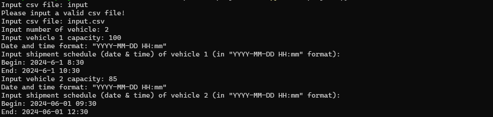
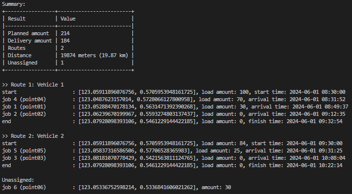
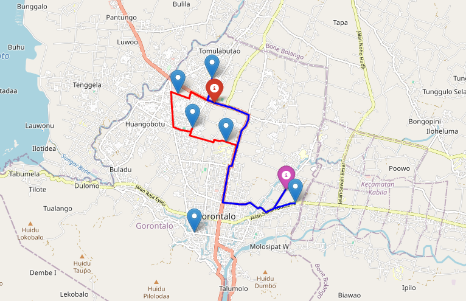

# Shipment Vehicle Routing Program
## Video Demo: https://youtu.be/8iHZ4ckA-Ig

## Description:
This program creates the optimized vehicle routes for shipment activity based on the given data and parameters. This program utilizes [OpenRuteService](https://openrouteservice.org/) API (based on [VROOM Project](https://github.com/VROOM-Project/vroom)) to solve the vehicle routing problem (VRP) as this project's goal.

## How does the program work?
The program will send a request based on the input data to Optimization endpoints of [OpenRuteService](https://openrouteservice.org/) API (a valid API key is needed). If the request succeeds, the program will receive a response in JSON format. This program will parse and then summarize the result and generate a map in HTML format (`route_map.html`) that shows the vehicle routes.

## To Do
#### Obtain an API key from the OpenRouteService website
Visit the [OpenRuteService](https://openrouteservice.org/) website and sign in or sign up for a free account. Once logged in, navigate to your account dashboard to request an API key (token). Copy the generated API key to the `.env` file located in the project directory or directly into `project.py`:
```commandline
# Load API key
api_key = "api_key"
```
> Note: The API key will be placed in `project.py`  in the submitted final project directory to CS50.


#### Input data
Below is a table of data structures that will be input to the program in CSV format.

| id               | lat                | long               | delivery_amount | service |
| ---------------- | ------------------ | ------------------ | --------------- | ------- |
| start_point      | ... | ... | 0               | 0       |
| end_point        | ... | ... | 0               | 0       |
| shipment_point01 | ... | ... | ...             | ...    |
| shipment_point02 | ... | ... | ...             | ...     |
| shipment_point n  | ...                | ...                | ...             | ...     |

> Note:
> * The shipment location details must begin with the start point, the endpoint, and then the shipment points
> * `id`: unique id/name of each location point (string)
> * `lat`: latitude (float)
> * `long`: longitude (float)
> * `delivery_amount`: delivery quantity of item (integer)
> * `service`: estimated unloading time in seconds (integer)
> * `delivery_amount` and `service` of the start and end point are 0 (zero) because there is no shipment nor service on those points

<br>
When the program is running, it will prompt you to enter some inputs which are:

* `Number of vehicles`: number of vehicles (integer)
* `Vehicle capacity`: the maximum capacity of the vehicle (integer)
* `Begin`: a time when the vehicle starts to operate (YYYY-MM-DD HH:MM)
* `End`: time when vehicle finishes to operate (YYYY-MM-DD HH:MM)
> Note: The times of `Capacity`, `Start time`, and `End time` will be prompted based on the number of the vehicle. 

#### Usage
Navigate to the project directory using the `cd` command.
```
cd project
```
Install dependencies.
```commandline
pip install -r requirements.txt
```
Run the program.
```
python project.py
```
Enter some inputs that the program will be prompted, for example:
* path to CSV file: `input.csv`, that contains this data:

| id          | lat                | long               | delivery_amount | service |
| ----------- | ------------------ | ------------------ | --------------- | ------- |
| start_point | 0.5705953948161725 | 123.05911896076756 | 0               | 0       |
| end_point   | 0.5461229144422185 | 123.07928098393106 | 0               | 0       |
| point01     | 0.5631471392390268 | 123.05288470178134 | 40              | 1200    |
| point02     | 0.5593274803137437 | 123.06239670199969 | 30              | 900     |
| point03     | 0.5421563811124765 | 123.08181070778429 | 25              | 750     |
| point04     | 0.5728066127800958 | 123.0487623157014  | 30              | 900     |
| point05     | 0.57706528365983   | 123.05837316586506 | 59              | 1770    |
| point06     | 0.5336841606021262 | 123.05336752598214 | 30              | 900     |


* Number of vehicles: `2`
* Vehicle 1 capacity: `100`
* Vehicle 1 beginning time: `2024-06-01 08:30`
* Vehicle 1 ending time: `2024-06-01 10:30`
* Vehicle 2 capacity: `85`
* Vehicle 2 beginning time: `2024-06-01 09:30`
* Vehicle 2 ending time: `2024-06-01 12:30`



Result.

Here is the solution summary:



* Planned amount: total planned delivery
* Delivery amount: total delivery for all routes based on the given parameters
* Routes: number of routes in the solution
* Distance: total distance for all routes
* Unassigned: number of tasks (point/location) that could not be served

Generated route map:




## Credits
* [OpenRouteService](https://openrouteservice.org/) / [openrouteservice-py](https://openrouteservice-py.readthedocs.io/en/latest/)
* [VROOM Project](https://github.com/VROOM-Project/vroom)
* [folium](https://python-visualization.github.io/folium/latest/)
* [tabulate](https://pypi.org/project/tabulate/)
* [python-dotenv](https://pypi.org/project/python-dotenv/)
