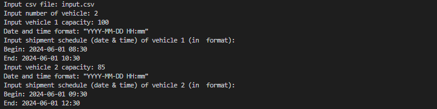
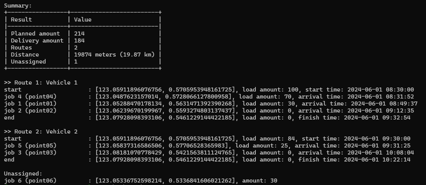

Number of Vehicle   : 2
Vehicle 1
    Capacity        : 100
    Start time      : 2024-06-01 08:30
    End time        : 2024-06-01 10:30
Vehicle 2
    Capacity        : 85
    Start time      : 2024-06-01 09:30
    End time        : 2024-06-01 12:30


# Shipment Vehicle Routing Program
## Video Demo:
## Description:
This program creates the optimized vehicle routes for shipment activity based on the given data and parameters. This program utilize [OpenRuteService](https://openrouteservice.org/) API (based on [VROOM Project](https://github.com/VROOM-Project/vroom)) to solve the vehicle routing problem (VRP) as this project's goal.

## How the program works?
The program will send a request based on the input data to Optimization endpoints of [OpenRuteService](https://openrouteservice.org/) API (a valid 
API key needed). If the request succeed, the program will be receiving a response in JSON format. This program will parse then summarize the result and generate a map in HTML format (`route_map.html`) that shows the vehicle routes.

## To Do
#### Obtain an API key from OpenRouteService website
Visit the [OpenRuteService](https://openrouteservice.org/) website and sign in or sign up for a free account. Once logged in, navigate to your account dashboard to request an API key (token). Copy the generated API key to `.env` 
file located in the project directory or directly into `project.py`:
```commandline
# Load API key
api_key = "api_key"
```
> Note: The API key will be placed in `project.py`  in the submitted final project directory to CS50.


#### Input data
Below is an example of table structure that will be an input to the program in CSV format.

| id               | lat                | long               | delivery_amount | service |
| ---------------- | ------------------ | ------------------ | --------------- | ------- |
| start_point      | ... | ... | 0               | 0       |
| end_point        | ... | ... | 0               | 0       |
| shipment_point01 | ... | ... | ...             | ...    |
| shipment_point02 | ... | ... | ...             | ...     |
| shipment_point n  | ...                | ...                | ...             | ...     |

> Note:
> * The shipment location details must begin with start point, end point, then shipment points (see example!)
> * `id` : unique id/name of each location point (string)
> * `lat` : latitude (float)
> * `long` : longitude (float)
> * `delivery_amount` : delivery quantity of item (integer)
> * `service` : estimated unloading time in seconds (integer)
> * `delivery_amount` and `service` of the start and end point are 0 (zero) because there is no shipment nor service on those points

<br>
When the program is running, it will prompts to enter some inputs which are:

* `Number of vehicle`: number of vehicle (integer)
* `Vehicle capacity` : the maximum capacity of the vehicle (integer)
* `Begin` : time when vehicle start to operate (YYYY-MM-DD HH:MM)
* `End` : time when vehicle finish to operate (YYYY-MM-DD HH:MM)
> Note: The times of `Capacity`, `Start time`, and `End time` will be prompted based on the number of vehicle. 

#### Usage
Navigate to the project directory using cd command.
```
cd project
```
Install dependencies.
```commandline
pip install -r requirements.txt
```
Run the program.
```
python project.py
```
Enter some inputs that program will be prompted, for example:
* path to CSV file: `input.csv`, that contains this data:

| id          | lat                | long               | delivery_amount | service |
| ----------- | ------------------ | ------------------ | --------------- | ------- |
| start_point | 0.5705953948161725 | 123.05911896076756 | 0               | 0       |
| end_point   | 0.5461229144422185 | 123.07928098393106 | 0               | 0       |
| point01     | 0.5631471392390268 | 123.05288470178134 | 40              | 1200    |
| point02     | 0.5593274803137437 | 123.06239670199969 | 30              | 900     |
| point03     | 0.5421563811124765 | 123.08181070778429 | 25              | 750     |
| point04     | 0.5728066127800958 | 123.0487623157014  | 30              | 900     |
| point05     | 0.57706528365983   | 123.05837316586506 | 59              | 1770    |
| point06     | 0.5336841606021262 | 123.05336752598214 | 30              | 900     |


* number of vehicle: `2`
* vehicle 1 capacity: `100`
* vehicle 1 beginning time: `2024-06-01 08:30`
* vehicle 1 ending time: `2024-06-01 10:30`
* vehicle 2 capacity: `85`
* vehicle 2 beginning time: `2024-06-01 09:30`
* vehicle 2 ending time: `2024-06-01 12:30`



Result.




Python
dotenv: For storing API keys securely.
folium: For visualizing maps and vehicle routes.
tabulate: For visualizing the summary of routing results.
OpenRouteService API: For solving the Vehicle Routing Problem.
Installation
Clone this repository:
bash
Copy code
git clone https://github.com/yourusername/shipment-vehicle-routing-app.git
Navigate to the project directory:
bash
Copy code
cd shipment-vehicle-routing-app
Install dependencies:
bash
Copy code
pip install -r requirements.txt


## Usage XXX


Visit the OpenRouteService website and sign up for a free account if you haven't already.
Once logged in, navigate to your account settings or dashboard to generate an API token.
Copy the generated API token.
Add the API token to the app:

Open the main.py script in a text editor.
Locate the line where the API token is required. It might be indicated with a comment or within a function/method that interacts with the OpenRouteService API.
Replace the existing API token with your own token:
python
Copy code
API_TOKEN = "YOUR_API_TOKEN_HERE"
Provide data in CSV format:

Prepare a CSV file containing the necessary information about route points (start, shipment points, and ending points), including latitude, longitude, delivery amount, and service time.
Run the app:
bash
Copy code
python main.py --csv path/to/your/data.csv
Input data manually:

Run the app:
bash
Copy code
python main.py --manual
Follow the prompts to input the number of vehicles, vehicle capacity, time window (in YYYY-MM-DD HH-SS format), and other relevant information.
Review the summary:

Once the inputted data is correct, the app will return a summary of the routing results.
It will also generate a route map in HTML format for visualization.
Features
Efficiently solves the Vehicle Routing Problem using the OpenRouteService API.
Supports data input from CSV files or manual input.
Visualizes maps and optimized vehicle routes using folium.
Provides a summary of routing results in a tabular format using tabulate.


## Examples
[Include examples or screenshots demonstrating how the app works.]


```
Input csv file: input.csv
Input number of vehicle: 2
Input vehicle 1 capacity: 100
Date and time format: "YYYY-MM-DD HH:mm"
Input shipment schedule (date & time) of vehicle 1 (in  format):
Begin: 2024-06-01 08:30
End: 2024-06-01 10:30
Input vehicle 2 capacity: 85
Date and time format: "YYYY-MM-DD HH:mm"
Input shipment schedule (date & time) of vehicle 2 (in  format):
Begin: 2024-06-01 09:30
End: 2024-06-01 12:30
```


## Credits
dotenv
folium
tabulate
OpenRouteService
License
[Specify the license under which your project is distributed, if applicable.]

This comprehensive README.md file provides users with all the necessary information to understand, install, and use your Shipment Vehicle Routing App. Adjust as necessary to fit your project's specific details and preferences.
